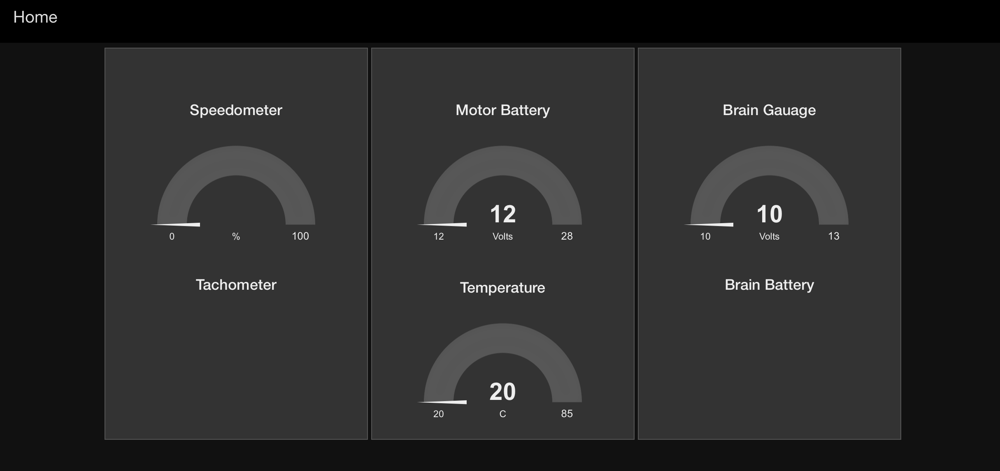

# Installation Steps #

## Pre-requisites ##
_(Lower versions may work, but I have tested on these versions and so am considering them to be the base versions)_
1. Node v8.0.0
2. npm v5.0.3
3. Node-RED v0.16.2

Apart from this, you may have to install the following nodes
<pre>
<table>
  <tr><th>Node</th><th>Version</th><th>Purpose</th><th>Installation</th></tr>

  <tr>
    <td>node-red-node-serialport</td>
    <td>v0.4.2</td>
    <td>Communication over Serial Port</td>
    <td>npm install node-red-node-serialport</td> 
  </tr>
  <tr>
    <td>node-red-node-smooth</td>
    <td>v0.0.10</td>
    <td>Provides several simple smoothing algorithms</td>
    <td>npm install node-red-node-smooth</td>
  </tr>
  <tr>
    <td>node-red-dashboard</td>
    <td>v2.3.11</td>
    <td>Dashboard in Node-RED</td>
    <td>npm install node-red-dashboard</td>
  </tr>
</table>
</pre>

## Running Instance ##
To run the Node-RED flow, execute `node-red flows_k9.json` in the shell / command prompt.

## Node-RED Dashboard ##
If the Node-RED is running fine, you should see the following display
<figure><figurecaption>Node-RED flow dashboard</figurecaption><figure>
